When it comes to picking a good theme as a starting point, the Ultimo theme seems to be the one we go with the most. It does come with some advanced admin modules and it’s extremely customizable. Making it the number one selling Magento theme on themeforest.net.

Ultimo is equipped with administrative module which gives you the ability to configure the visual appearance of your store. I will display one of Ultimo built in feature, the slideshow. I will show you how to add it to your homepage on a Magento 2 store. The slideshow is a great place to start when trying to draw in new prospect. The slideshow is useful for headlining whatever content you want the person browsing your store to see first.

Note: In order to proceed forward with any edit of the admin panel you must have an account with the correct user permissions.

There are two ways the Ultimo theme can be used to set-up the slideshow. The less complex way is using the admin panel. We will discuss this option.

You can find the settings by navigating to Stores -> Settings -> Configuration.

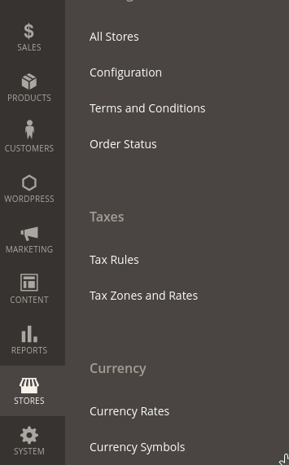

Just expand the INFORTIS EXTENSIONS tab and you will see the setting there.

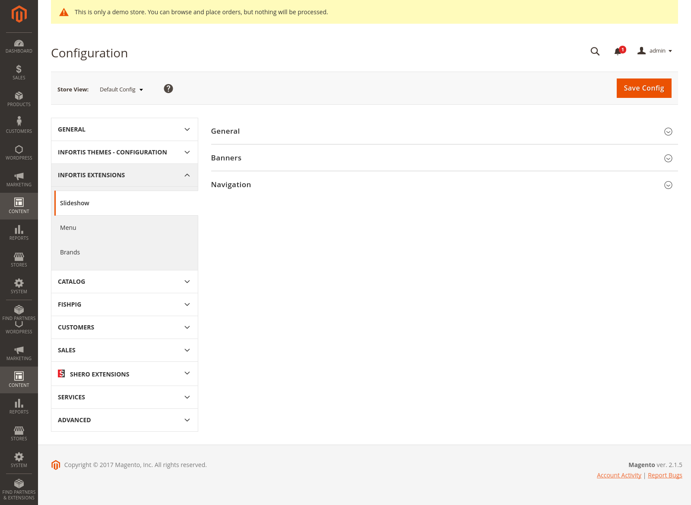

Note: To view your changes on the store frontend,you should disable Magento cache before you start configuring your store. Otherwise you will need to flush the cache in order to see any changes you have made in the config.

In the slideshow tab, you will have three sub tabs that will list out the slider settings.

**The General tab settings:**

1. Transition Effect – the effect to be used for transition between two slides.
1. Timeout – time (in milliseconds) between slide transitions. Enter 0 to disable automatic transition. Note that 1000 milliseconds is equal to 1 second. You can also leave empty to use simple horizontal slide animation.
1. Transition Speed – duration (in milliseconds) of slide transition animation. Defines how fast the current slide is replaced with the next slide.
1. Smooth Height – enable, if slides do not have the same height. It will allow height of the slideshow to animate smoothly.
1. Pause on Hover – if enabled, when the mouse is over the slideshow the automatic transition functionality will pause.
1. Loop – if enabled, animation will loop.
1. Hide Slides On Mobile Devices – if set to Yes, slideshow will be hidden on mobile devices (if browser viewport width is less than 768 pixels). Important: banners can be hidden separately, see options below.

There will still be some manual work to do to get the slider to show your content on the homepage. In the Slides field, you will have to write out the name of your static identifier by comma separated.

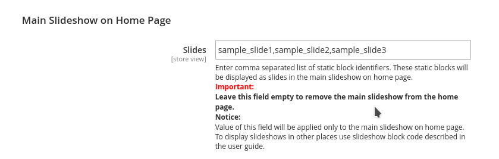

I have elected the names of sample_slide1, sample_slide2 and sample_slide3. You could keep adding static identifiers if you wanted too.

To create your static blocks that will be use on the slideshow, go to the Content -> Blocks.

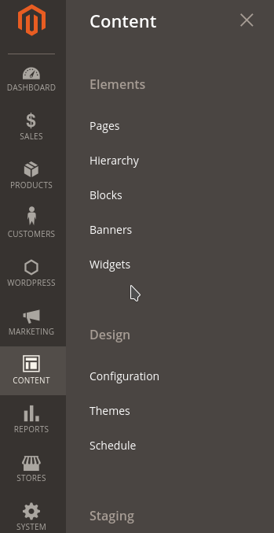

You should now see a list of static blocks that you may or may not have created. We are only concerned with creating new ones for the slider.

You will click on add new block.

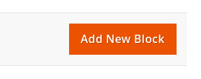

You must make sure the block is enable. Make sure to be descriptive with the naming. Supply a name that you will easily be able to remember on what the block does. When you revisit this part of the admin panel months later you will want to be able to read the name of the block and be able to know what it was created to do.

The identifier is also very important to write out correctly. A misspelling here and your homepage won’t display your newly created block.

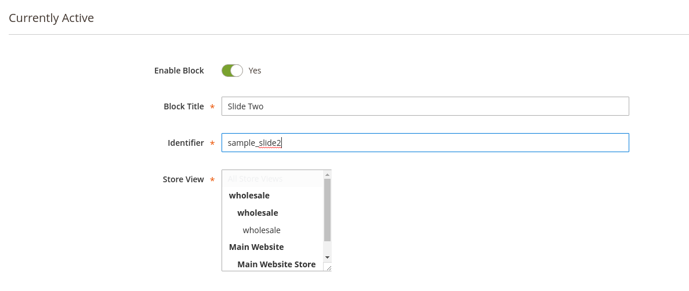

Here comes the fun part, the editor. You can select to use the wysiwyg if you’re not comfortable writing html. I always disable the wysiwyg and insert my own html. In this example I’m just inserting a placeholder image.

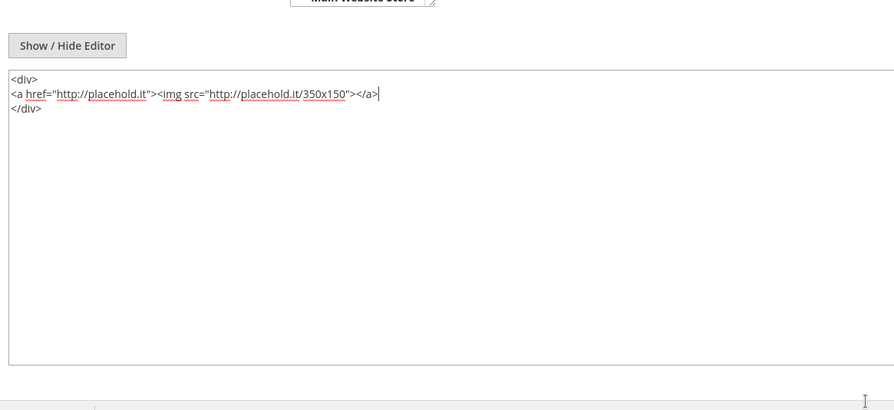

Now when you view the front end of your store you should see a slideshow of whatever content you supplied in your static blocks on the home page. For my example, I use a test Magento 2 website with just a placeholder image.

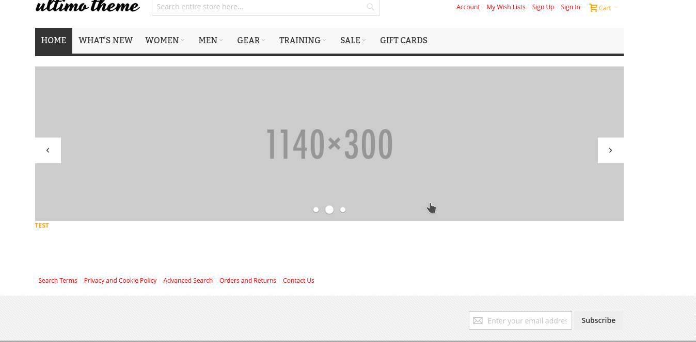

Now with some content to display, we can continue going down the options in the admin sittings for the slideshow.

1. Position: Above Content Area, Full Width – if enabled, the main slideshow will be displayed at the top of the main content area of the home page (just below the main menu). Slideshow will take full available width.
1. Position: Above Content Area, Boxed – if enabled, the main slideshow will be displayed at the top of the main content area of the home page (just below the main menu).
1. Top Margin – additional top margin for the slideshow. You can set margin to add extra space above the slideshow. Enter negative value to pull the slideshow up.
1. Bottom Margin – additional bottom margin for the slideshow. You can set margin to add extra space below the slideshow. Enter negative value to push the slideshow down.

**Adding a Banner to the Main Slideshow on the Home Page**

The Ultimo theme also let’s you add small banners to the main slideshow on the home page. Banners configured in this manner will be applied only to the main slideshow on the home page.

The banner content is created and inserted just as the slideshow was. You will have to create an identifier name and add it to the banner field.

In my example, I choice to call it sample_slideshow_side_banners.

Note: Leaving this field empty will remove the banner from the main slideshow on the home page.

You will now want to head back to the Content > Block settings in the admin panel where you will use your identifier name to create the block to be use in your banner.

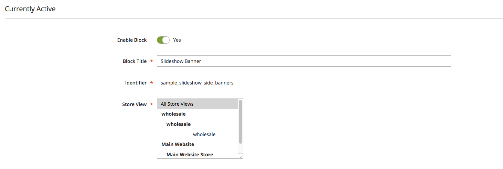

The content I inserted was a quick little example just for illustration. I opted to leave the wysiwyg editor enable this time around.

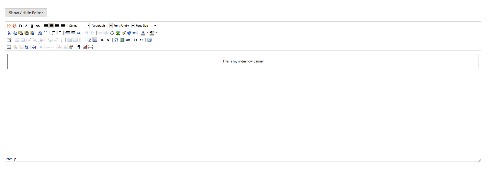

**The Banners tab settings:**

For the Banners sub-tab, you have the following options;

1. Position of Banners – select position of the banners.
1. Hide Banners On Mobile Devices – if set to Yes, banners will be hidden on mobile devices (if browser viewport width is less than 768 pixels).

The navigation sub-tab will be last on the list. It’s how you control the pagination of the slider. The pagination is quite useful as it will allow your user to navigate through whatever content you have supplied on the slideshow.

These are the arrows and dotted areas of the slideshow.

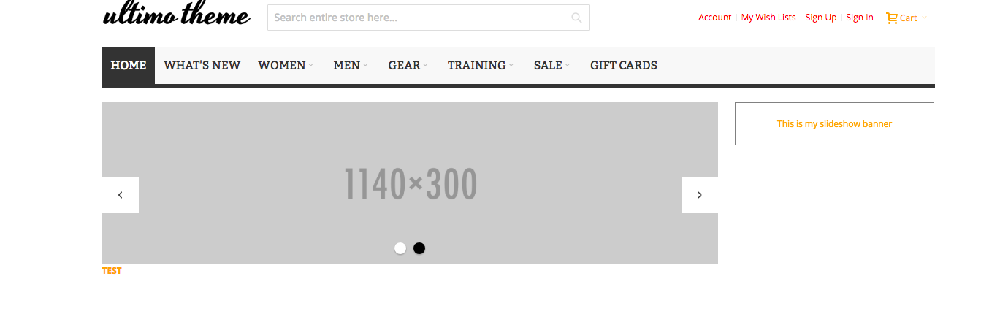

**The Navigation tab settings:**

In this tab you can configure slideshow navigation elements.

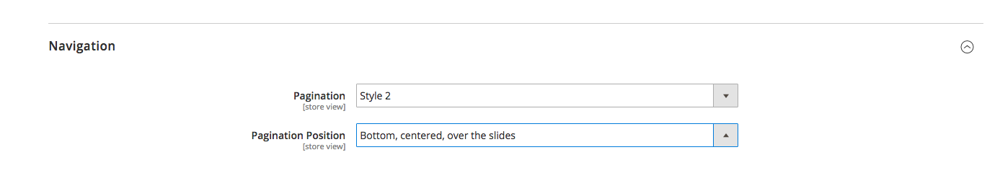

1. Pagination – enable/disable and select style of pagination.
1. Pagination Position – select position of the pagination.

If you have followed along. You should now be seeing a slideshow on your Magento 2 store using the Ultimo theme. There’s tons of features that come built into the Ultimo theme. As the weather is getting warmer, I will advise grabbing a cup of coffee or tea and having a read of their PDF manual. With over 200 pages, you will find some neat functionality that will make your store more attractive to your viewers.
